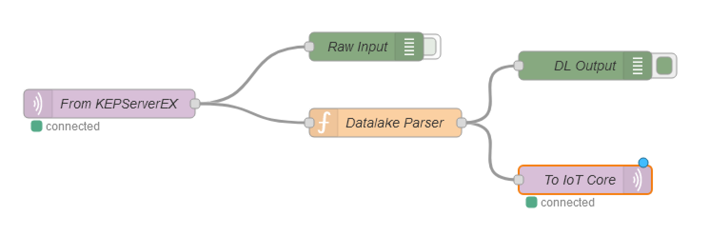

# Edge Gateway Set Up
This folder contains a number of Ansible YAML files that are needed to execute the playbook defined in `setup.yml`.  [Ansible](https://www.ansible.com/use-cases/configuration-management) is a lightweight provisioning and configuration management tool that relies on ssh to configure target systems.

The Makefile in this folder has several options:

* To install Ansible itself
    * `setup-debian-repo` can be run *first* on an Ubuntu/Debian system to retrieve the Ansible package from the correct repo
    * `setup-ansible` can be used to configure an Ubuntu or other Debian based OS to run Ansible including Raspian / Raspberry Pi OS

    For a system running Ubuntu just run `make setup-ansible`.  

* To configure the Edge Gateway resources (eg. Node-RED and Mosquitto MQTT broker)  
    * `install` will copy local files to the edge gateway and set up a systemd unit that will autostart the necessary containers
# Prereqs
The requirements to run Ansible are few since it relies on ssh to interact with the destination systems.  In order to run this particular playbook playbook, the following are needed.

* Execution of the following roles from the [ansible.pem](https://bitbucket.org/peminfo/ansible.pem/src/master/) repository.  These should be applied to the edge gateway prior to running this playbook.  Among other things they will install security software, configure DNS, permissions, etc.  See [Andy Ritting](mailto:aritting@pemnet.com) for further details.  
    * mfgiiot4-eg  
    * security  
    * domain-join  
    * common  
* Device data endpoint as defined by AWS.  This is unique per account and region and is viewable from the [AWS Console in the IoT Core settings](https://us-east-1.console.aws.amazon.com/iot/home?region=us-east-1#/settings).  This will be used in the `awsiot_endpoint` variable in hosts.yml
  
* X509 certificates specific to the 'IoT Thing' we're using to ingest data.  Note that there should be exactly one of these "iot-cert" buckets in a given AWS account and each bucket will only have the files relevant for the device that was deployed.  For example, these are currently stored in an environment specific S3 bucket in the following way.  
    * `s3://iiot-galway-iot-cert-dev-239060160397-us-east-1-1b51/iiot-galway-dev-certificate.pem`  
    * `s3://iiot-galway-iot-cert-dev-239060160397-us-east-1-1b51/iiot-galway-dev-private.pem`  
* [Amazon CA certificate](https://www.amazontrust.com/repository/AmazonRootCA1.pem)  

All three of the above mentioned PEM files (eg. certificate, private key, and AWS CA) should be stored locally on the system running ansible.  The hosts.yml will rely on the `x509_src` variable to locate them when the playbook runs.

## Copy ssh keys to target system (optional)
To streamline the process, you can copy your ssh keys to the remote system.  This will allow you (and the Ansible scripts) to remotely connect to the target system without being prompted for a password.  Instead, it will rely on your credentials kept in ~/.ssh.

1. If you haven't set up a keypair previously, you will want to run the following command.
```
❯ ssh-keygen -t ecdsa
Generating public/private ecdsa key pair.
Enter file in which to save the key (~/.ssh/id_ecdsa):
Created directory '~/.ssh'.
Enter passphrase (empty for no passphrase):
Enter same passphrase again:
Your identification has been saved in ~/.ssh/id_ecdsa.
Your public key has been saved in ~/.ssh/id_ecdsa.pub.
The key fingerprint is:
SHA256:3wPOzNIdekiCJNzNK5xXXFNdPTJja/ljjKkMPSXR/UY AABBCCDD@mysystem.local
The key's randomart image is:
+---[ECDSA 256]---+
|            +.o.+|
|   . . o . o B oE|
|    o o o o o *.o|
|     + o o . =  o|
|      = S + = =. |
|       o @ O + = |
|        . % B . .|
|         . + .   |
|                 |
+----[SHA256]-----+
```
2. From your remote machine (not the Raspberry Pi) copy the ssh key to your local ssh keys to make access easier (`ssh-copy-id <userName>@<hostNameIPAddress>`).

For example:
```bash
remote-machine:~ $ ssh-copy-id user@192.168.0.27
```

You will be asked for the password. Enter the user's password for the edge gateway.

# Installation

Now that Ansible is set up, we need to update a config file so we can execute the playbook.

## Update the local configuration
We will need to tell Ansible a few things before it can run.  For that, we will update the [ansible/hosts.yml](ansible/hosts.yml) file.

The `hosts.yml` will look similar to the following.  This will need to be modified as follows:  

* The value associated with the `ansible_host` key represents the IP address of the target system (ie. the edge gateway)  
* The value associated with the `username` key represents the username that will be used when trying to ssh to the `ansible_host`  
* The value associated with the `mqtt_broker` key represents the Mosquitto MQTT broker's IP address  
* The value associated with the `awsiot_endpoint` key represents the AWS IoT Core endpoint, this can be found from AWS console  
* The value associated with the `x509_src` key represents the location where the x509 certificates can be found  
* The value associated with the `location` key represents the location code for the manufacturing plant  
* The value associated with the `repo_root` key represents the staging location on the edge gateway, this is NOT where code will directly run from  
* The value associated with the `ansible_python_interpreter` key represents the staging location of the Python interpreter on the `ansible_host`  

```yaml
all:
  children:
    dev:
      hosts:
        ###############################################
        test_gateway:
          # IP address / hostname of the edge gateway
          ansible_host: 13.58.192.114

          # Username that will install services onto the edge gateway
          username: ubuntu
          
          # IP address / hostname of the MQTT broker (typically same as ansible_host)
          mqtt_broker: 13.58.192.120

          # AWS IoT Core endpoint, this can be found from AWS console
          awsiot_endpoint: a1mxujejfvl7r9-ats.iot.us-east-2.amazonaws.com

          # Location where the x509 certificates can be found, currently stored in an S3 and must be
          # download locally.

          # !!!!!!!!!!!
          # IMPORTANT: Since this variable represents a folder, the trailing '/' IS REQUIRED
          # !!!!!!!!!!!
          x509_src: ~/certs/test/ 

          # Location code for the manufacturing plant
          location: gal

          # Staging location on the edge gateway, this is NOT where code will directly run from
          repo_root: /tmp/staging

          # Set Python version used by Ansible
          ansible_python_interpreter: /usr/bin/python3.8
```

## Execute the playbook

By now you should have the following:

* Ansible installed locally  
* Local copy of X509 certificates  
* Updated [ansible/hosts.yml](ansible/hosts.yml) file  

Now you can install the ansible playbook via `make install`.  This will set up all servers defined in hosts.yml.  For targeted installs you may call ansible-playbook as follows:

`ansible-playbook -i hosts.yml setup.yml` # Update ALL defined systems   
`ansible-playbook -i hosts.yml -l dev  setup.yml` # Update only the systems defined in the dev section  
`ansible-playbook -i hosts.yml -l test_gateway  setup.yml` # Update the host defined as test_gateway  
`ansible-playbook -i hosts.yml -l test_gateway  setup.yml --ask-pass --ask-become-pass` # Update the host defined as test_gateway and prompt the user for the password to access the ansible host.  It also prmopts for the sudo password which is used in steps that include `become: true`.


# Verification

As the script runs you should see a summary from Ansible that looks something like this.

```
❯ ansible-playbook -i hosts.yml -l test_gateway  setup.yml

PLAY [Setting up Edge Gateway Device for IoT] **********************************************************************************************

TASK [Gathering Facts] *********************************************************************************************************************
ok: [test_gateway]

TASK [Copy docker resource files to the edge gateway] **************************************************************************************
changed: [test_gateway]

TASK [Place X509 certificate in appropriate location] **************************************************************************************
ok: [test_gateway]

TASK [Update the topic string used in the To IoT Core node] ********************************************************************************
changed: [test_gateway]

TASK [Update the topic string used in the Datalake Parser node] ****************************************************************************
changed: [test_gateway]

TASK [Update the local MQTT broker's IP address used in the mqtt-broker config] ************************************************************
changed: [test_gateway]

TASK [Update the AWS IoT Core endpoint IP address used in the mqtt-broker config] **********************************************************
changed: [test_gateway]

TASK [Create systemd wrapper for docker compose] *******************************************************************************************
ok: [test_gateway]

TASK [Create specific service for edge gateway] ********************************************************************************************
changed: [test_gateway]

TASK [Rreload the edge gateway service units] **********************************************************************************************
changed: [test_gateway]

TASK [Make sure edge gateway service unit is running] **************************************************************************************
changed: [test_gateway]

PLAY RECAP *********************************************************************************************************************************
test_gateway               : ok=11   changed=8    unreachable=0    failed=0    skipped=0    rescued=0    ignored=0

```

At this point, you can go to a web browser and visit the Node-RED endpoint.  This is accessible at http://{{ **ansible_host** }}:1880.  In the above configuration it would be http://13.58.192.114:1880.  When Node-RED opens you should see a screen that contains a flow, similar to the one in the following image.   

If the green squares indicated status as 'connected' it means the edge gateway is connected to the local Mosquitto MQTT broker and also to AWS IoT Core.  At this point it's ready to receive messages.

